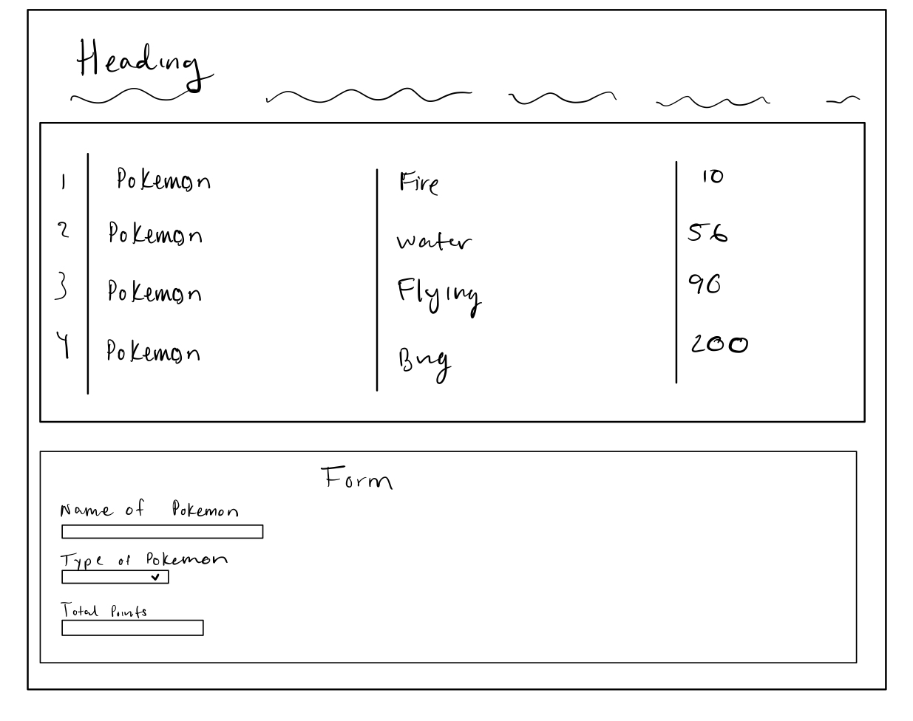
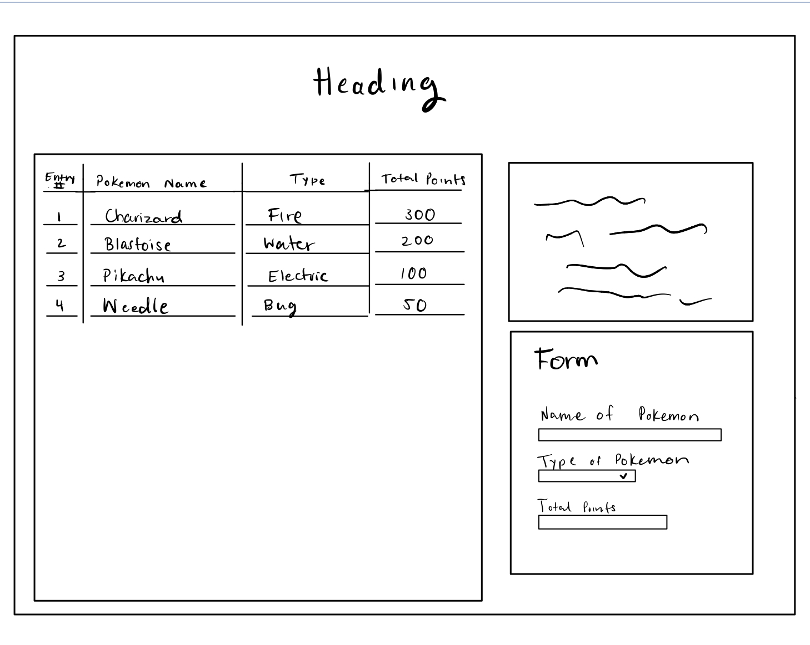

# Project 2: Design Journey

**For each milestone, complete only the sections that are labeled with that milestone.** Refine all sections before the final submission.

You are graded on your design process. If you later need to update your plan, **do not delete the original plan, rather leave it in place and append your new plan _below_ the original.** Then explain why you are changing your plan. Any time you update your plan, you're documenting your design process!

**Replace ALL _TODOs_ with your work.** (There should be no TODOs in the final submission.)

Be clear and concise in your writing. Bullets points are encouraged.

**Everything, including images, must be visible in _Markdown: Open Preview_.** If it's not visible in the Markdown preview, then we can't grade it. We also can't give you partial credit either. **Please make sure your design journey should is easy to read for the grader;** in Markdown preview the question _and_ answer should have a blank line between them.


## Design Plan (Milestone 1)

**Make the case for your decisions using concepts from class, as well as other design principles, theories, examples, and cases from outside of class (includes the design prerequisite for this course).**

You can use bullet points and lists, or full paragraphs, or a combo, whichever is appropriate. The writing should be solid draft quality.


### Catalog (Milestone 1)
> What will your catalog website be about? (1 sentence)
>
> My catalog will be a Pokedex database, which will include different types of pokemon and their special characteristics.


### Audience (Milestone 1)
> Briefly explain your site's audience. Your audience should be specific, but not arbitrarily specific. (1 sentence)
> Justify why this audience is a **cohesive** group. (1-2 sentences)
> My site's audience are people who like to watch Pokemon and play the pokemon card games. People who play with pokemon trading cards tend to look up the pokemon and their characteristics. People who watch Pokemon like to do the same to see what Pokemon may be the strongest. This audience is a cohesive group because whether you play, watch, read, or learning about Pokemon, the database is useful to all Pokemon enthusiasts. The audience is directly targeted towards one group who all find entertainment in Pokemon.


### Audience Goals (Milestone 1)
> Document your audience's goals for using this catalog website.
> List each goal below. There is no specific number of goals required for this, but you need enough to do the job (Hint: It's more than 1. But probably not more than 3.)
> **Hint:** Users will be able to view all entries in the catalog and insert new entries into the catalog. The audience's goals should probably relate to these activities.

Goal 1: They will be able to enter a new pokemon and their characteristics onto the catalog

- **Design Ideas and Choices** _How will you meet those goals in your design?_
  - I will be able to meet this goal in my design by creating a form on the main page where the audience can input the name of a pokemon and any known charactersitics.
- **Rationale & Additional Notes** _Justify your decisions; additional notes._
  - This is a good decision because it I will be able to take the information given on the form and place it into the catalog live. That way the audience can see their entry.

Goal 2: The audience will be able to see a list of Pokemon and the different types of Pokemon

- **Design Ideas and Choices** _How will you meet those goals in your design?_
  - The catalog will have a category for the types of pokemon and the varying species.
- **Rationale & Additional Notes** _Justify your decisions; additional notes._
  - Adding a column in the catalog can help people differentiate the Pokemon and what they want to look for. Additionally, listing out all the different Pokemon in the catalog will allow the audience to view it all very easily.


### Audience Device (Milestone 1)
> How will your audience access this website? From a narrow (phone) or wide (laptop) device?
> Justify your decision. (1 sentence)
They audience will access this website from a wide device, like a laptop. This is because there are many different characteristics to a Pokemon and instead of horizontally scoring on a narrow device, it is much easier to view all these categories on a wide screen


### Persona (Milestone 1)
> Use the goals you identified above to develop a persona of your site's audience.
> Your persona must have a name and a face. The face can be a photo of a face or a drawing, etc.


Timothy

**Factors that Influence Behavior:**

> - Plays with Pokemon cards
> - Forgetful
> - Does not know much about Pokemon and their characteristics

**Goals:**
> - He wants to know the strongest Pokemon so he can beat others in a game
>
> - Learn more about Pokemons

**Obstacles:**
> - Does not want to watch all the Pokemon episodes to learn about the Pokemon
> - Does not want to search up each pokemon individually
> - Sometimes forgets the Pokemon he learned about


**Desires:**
> - Can add a new pokemon he learns about so he does not forget about it
> - Can easily locate all the information he needs to know about the pokemon in one chart


### Catalog Data (Milestone 1)
> Using your persona, identify the data you need to include in the catalog for your site's audience.
> Justify why this data aligns with your persona's goals. (1 sentence)


> - Id numbers
> - Name of Pokemon
> - Total points
> - Type of Pokemon


> - The ID numbers are necessary so Timothy can keep track of what Pokemon he enters.
> - The name of the Pokemon is necessary so Timothy knows what pokemon card he is referring to
> - The total points are necessary because he adds up all the points the Pokemon has, telling you which one is the strongest
> - The type of Pokemon will allow Timothy to categorize the Pokemon cards further more and be more familiar with what he is dealing with


### Site Design (Milestone 1)
> Design your catalog website to address the goals of your persona.
> Sketch your site's design:
>
> - These are **design** sketches, not _planning_ sketches.
> - Use text in the sketches to help us understand your design.
> - Where the content of the text is unimportant, you may use squiggly lines for text.
> - **Do not label HTML elements or annotate CSS classes.** This is not a planning sketch.
>
> Provide a brief explanation _underneath_ each sketch. (1 sentence)
> **Refer to your persona by name in each explanation.**


> In the first iteration, I made a rough draft of what data I want to place in each column. The catalog I made shows the ID numbers, the pokemon name, the type of pokemon, and the total points or strength it has.

> In the second iteration, I made it more clear as to what my coulmns are by labeling them. I also decided the heading for the catalog is more effective in the center, above the catalog.Additionally, I designed the website to have a form on the right side of the table, instead of the bottom. This way, the person does not have to scroll all the way to the bottom to use the form. Lastly, I added text right above the form to provide contextual infromation about Pokemon.


### Catalog Design Patterns (Milestone 1)
> Explain how you used design patterns for online catalogs in your site's design. (1-2 sentences)

> I used design patterns for the online catalogs in my site's design by putting the more contextual data to the left and the less contextual information to the right. This is becasue, as we previously learned, the user reads the webite from left to right. By putting data that states the context on the left, such as the name of the pokemon and the type of pokemon, the user will have a better experience using the catalog. They will instantly see what the catalog data is reffering to. Additionally, the catalog utizlizes a “list” or “table” desing pattern.


## Implementation Plan (Milestone 1, Milestone 2)

**Provide enough detail in your plan that another 2300 student could implement your plan.**

### Database Schema (Milestone 1)
> Plan the structure of your database. You may use words or a picture.
> A bulleted list is probably the simplest way to do this.
> Make sure you include constraints for each field.

Table: Pokemon Pokedex

- ID Number: Int {Not Null, Primary Key, AutoIncrement, Unique },
- Name of Pokemon: Text{NN, U}
- Type of Pokemon: Int{NN} ---> this will use key value coding, there are 18 types of pokemon
- Total Points: Int{NN}


### Database Query Plan (Milestone 1, Final Submission)
> Plan your database queries.
> You may use natural language, pseudocode, or SQL.

1. All Records (Milestone 1)

    ```
    $result = exec_sql_query($db, 'SELECT * FROM pokemon;');
    ```

2. Insert Record (Final Submission)

  ```
35, Pidgeot, 10, 256
36, Snorlax, 11, 560
37, Rattata, 12, 234
38, Spearow, 1, 262
39, Chansey, 1, 450
40, Ninetales, 2, 505
41, Charmeleon, 2, 405
42, Jigglypuff, 18, 270
43, Ditto, 1, 117
44, Wigglytuff, 1, 400
    ```


### From Validation (Milestone 2)
> Plan the validation criteria for each piece of form data.

- Name of Pokemon
  - Text, name of a pokemon
  - There needs to be name of a pokemon
- Type of Pokemon
  - dropdown box of criteria
  - Need to select at least one type from dropdown
- Total Points
  - Integers
  - Needs to have this filled out with integers


### Form Planning (Milestone 2)
> Plan your form validation using **pseudocode**.

```
Show the default state of page

if (form was submitted)
   1. store form data as variables
   2. assume the form is valid
   3. validate each peice of data
        if $name is empty
          $form_valid = false
          show feedback for name

        if $type is empty
          $form_valid = false
          show feedback for type

        if $total is empty
          $form_valid = false
          show feedback for total

        if $form_valid = true
          show the confirmation

        else
          set sticky values and echo them

```


### Form Test Data (Milestone 2)
> For each piece of form data, provide samples of valid and invalid data for testing.

**Valid Test Data:**

- Name of Pokemon: "Shedninja"
- Type of Pokemon: "Bug"
- Total Points: "236"


**Invalid Test Data:**

- Name of Pokemon: "122"
- Type of Pokemon: "Jumping" or no entry
- Total Points: "One hundred"


## Complete & Polished Website (Final Submission)

### Accessibility Audit (Final Submission)
> Tell us what issues you discovered during your accessibility audit.
> What do you do to improve the accessibility of your site?
>
> During the my accessiblity audit, I discovered that I had a lot of contrast errors on my table. I made the table's color darker so it would be easier to read the text. These were the only errors during my accessbility audit and improvide the accessibility of my site greatly.


### Self-Reflection (Final Submission)
> Reflect on what you learned during this assignment. How have you improved from Project 1? What would you do differently next time? (2-3 sentences)

> I improved on writing and thinking of new code on my own. Usually, in project one I did not apply what I know, rather I just wrote down code I learned about in lecture. However, in this project I was able to debug and write new code to fix it becasue I was able understand PHP code and manipulate how I want it. Next time, I would start off by not referring to any lecture or lab code and try to think of the code on my own before getting help.

> Take some time here to reflect on how much you've learned since you started this class. It's often easy to ignore our own progress. Take a moment and think about your accomplishments in this class. Hopefully you'll recognize that you've accomplished a lot and that you should be very proud of those accomplishments! (1-3 sentences)

> I am getting better at picking color patterns and picking up spcefifc design patters. I believe that the little details matter for the user and I am starting to realize that. I also think we have learned a gret amount for this project and being able to create forms based on data is a big accomplishment in the backend world. I enjoy learning how to do things on a website that are so basic, yet so foundational.


### Collaborators (Final Submission)
> List any persons you collaborated with on this project.


### Reference Resources (Final Submission)
> Please cite any external resources you referenced in the creation of your project.
> (i.e. W3Schools, StackOverflow, Mozilla, etc.)

https://en.wikipedia.org/wiki/Pok%C3%A9mon
